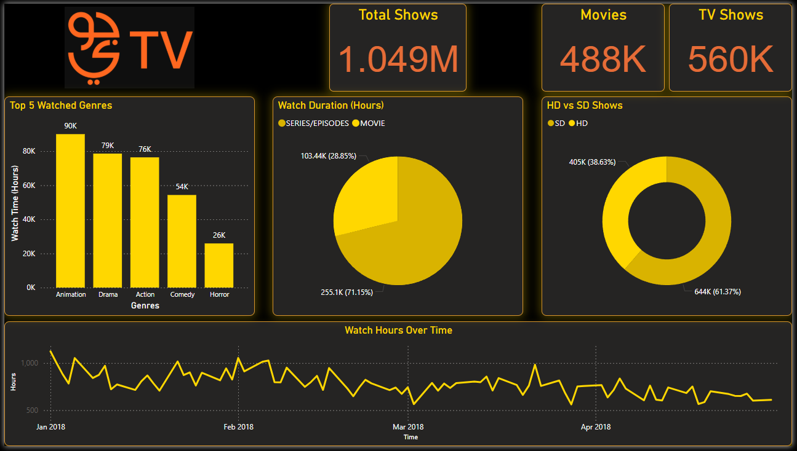

# Virtual Work Experience - Data analysis at STC
An online program by STC x Misk that simulates real-world data analysis tasks, from user behavior analysis to predictive modeling and storytelling

## Kaggle Notebook
[https://www.kaggle.com/code/bandarai/virtual-work-experience-stc-data-analysis](https://www.kaggle.com/code/bandarai/virtual-work-experience-stc-data-analysis)

## Additional
As an extra work on my part, which was not required for any task, I tried using PowerBI to visualize the data

